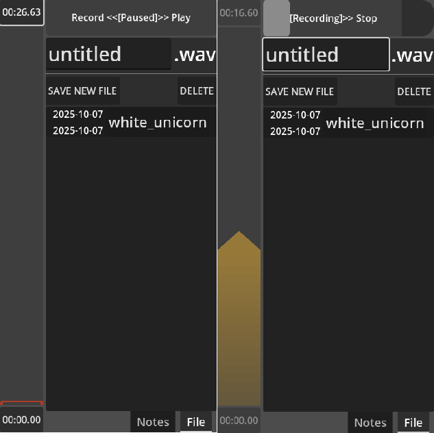

For Paracortical Initiative, 2025, Diogo "Theklo" Duarte

Other projects:
- [Bluesky for news on any progress I've done](https://bsky.app/profile/diogo-duarte.bsky.social)
- [Itchi.io for my most stable playable projects](https://diogo-duarte.itch.io/)
- [The Github for source codes and portfolio](https://github.com/Theklo-Teal)
- [Ko-fi is where I'll accept donations](https://ko-fi.com/paracortical)

# DESCRIPTION
A hassle-free voice recording for mobile which tries to mimic tape recorders and dictaphones of old. Made in the Godot Engine. You can just focus on record and playback quickly and not bother with handling files, loading or saving or thinking about the names of files, until you really want to save something.
This is part of my collection of projects in indefinite hiatus. I release it publicly in case someone likes the ideas and wants to develop them further or volunteers to work with me on them.
See "WHY_IN_HIATUS" for more information.

# THE CONCEPT
I first intended this as a tool to help voice training. I could record my voice, play back immediately to get quick feedback and overwrite what I didn't like, allowing to repeat practice many times, witout bothering with ever growing audio files or having to write save file names every time.
But I suppose it wouldn't be too hard to use this application to take notes, much like in old voice recorders were used as. I just need to associate a timestamp with a string of text.
You could even just use this app to help make transcripts for speeches or lyrics for songs. As the audio plays, it will show as subtitles on top of the window.
It becomes intuitive to splice audio in this way. Maybe in the future I could add a non-destructive splice feature, where it insert new data instead of overwriting?

# INSTALLATION
Put these files in your Godot projects folder and search for it in project manager of Godot! Compatible with Godot 4.5.
There's a sample of the song "White Unicorn" by Wolfmother as a reference WAV file. Remove this when exporting the project.

# USAGE
The long vertical bar at the right is effectively the playback seeking slider. It's meant to look like a magnetic tape.
It tells you the length of a current recording, and the time where the playhead indicator is at. You may click these timestamps to skip the playhead to the start and end of the recording.
The horizontal bar at the top is like a slider switch. Slide one way to start recording, the other way to playback or let it in the center to stop/pause.
When recording, it will overwrite whatever is at the position of the moving playhead. If the playhead reaches the end of the audio, it will accomodate the more recording length.
The application works from the start assuming a default audio file, which isn't stored as a file yet. You can record without minding about anything.
You can click on a existing file from the list and then it will work with that audio. Or you can click "New File" to save a new audio.
A new file from an existing audio will create a duplicate of the current working file.
The "delete" button eliminates an existing current working file, or clears any data in the current recording.

# WHY_IN_HIATUS
Godot isn't great to manipulate audio files. There's a way to have raw PCM data from recordings, but no way to convert to WAV.
You may record as a WAV, but the sample/buffer data in it isn't just PCM so editing is prone to glitches and corruption in the audio. And I don't know how to convert to a raw PCM buffer.
If I had more intimate understanding of WAV files, or maybe knew how to code with C# which has libraries for this, maybe I could solve these issues, but I don't have that skill.
Another minor issue is how to store metadata about the audio files. Maybe some of it could be in the WAV file itself, but I don't think Godot can read and write metadata on files.
For transcripts/notes, it gets more complicated. I like using the TOML format, but it might not allow enough complexity to save all parameters of each subtitle and still be able to associate them to a particular audio file.
Maybe this is just a matter of thinking deeper into it, but the other issues with the project were taking priority.
